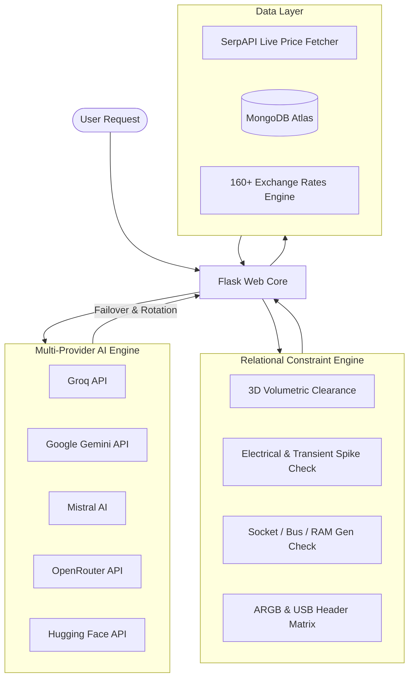

# 🖥️ RigMaster AI

> **Next-Generation AI-Powered PC Building, Compatibility Verification & Hardware Optimization Engine**

RigMaster AI is an intelligent web application designed to help gamers, professionals, creators, and system builders design, validate, and optimize PC builds. Powered by a **multi-provider AI rotation engine** and an **advanced relational constraint validator**, RigMaster AI ensures complete 3D volumetric clearance, electrical safety, hardware compatibility, and real-time live market pricing.

---

## 🌟 Key Features

### 🧠 Multi-Provider AI Recommendation Engine
* **Automatic Failover & Quota Rotation**: Intelligently switches between **Groq**, **Google Gemini**, **Mistral AI**, **Hugging Face**, and **OpenRouter** APIs to ensure 99.9% availability without hitting rate limits.
* **Custom AI PC Builder**: Generates tailored component configurations based on budget, primary workload (Gaming, Workstation, Video Editing, AI/ML, Streaming), target resolution (1080p, 1440p, 4K), and aesthetic preferences.
* **Smart Healing & Upgrade Suggestions**: Detects bottlenecks (CPU/GPU sync, RAM latency, PCIe version mismatches) and automatically suggests optimal replacement components.

### 📐 Advanced Relational Constraint Engine
Validates builds across 4 core engineering dimensions with severity scoring (**INCOMPATIBLE**, **WARNING**, **SUBOPTIMAL**, **OPTIMAL**):
1. **Volumetric 3D Clearance**: Verifies GPU length vs. case clearance, CPU cooler height vs. case width, and radiator mounting compatibility.
2. **Electrical & Transient Power Mapping**: Calculates TDP requirements, transient power spikes, PSU wattage adequacy, and 12VHPWR connector specs.
3. **Socket & Bus Compatibility**: Checks CPU-to-Motherboard sockets, RAM generational alignment (DDR4 vs. DDR5), and PCIe lane bottlenecks.
4. **Pin & Header Matrixing**: Verifies ARGB, USB 3.2, and PWM fan header availability.

### 💰 Real-Time Live Pricing & Global Multi-Currency
* **SerpAPI Live Shopping Integration**: Fetches real-time market prices for components with an automated MongoDB caching layer.
* **160+ Global Currencies**: Full support for real-time currency conversion across USD, EUR, GBP, INR, JPY, CAD, AUD, and 150+ additional regional currencies.

### 📄 Safe Export System (PDF & CSV)
* **Crash-Safe PDF Manifests**: Powered by a custom `SafeFPDF` engine that automatically sanitizes Unicode currency symbols (₹, €, £, ¥, ₩, ₺) to prevent font crashes.
* **CSV Export**: One-click download of complete hardware bills of materials (BOM).

### 👥 Collaboration & Build Vault
* **Build Vault**: Save, share, fork, and manage custom PC builds.
* **Group Builder**: Collaborative multi-rig building tool for teams, LAN centers, and hardware consultants.
* **Admin Dashboard**: Live tracking of AI provider health, quota metrics, user roles, site settings, and hardware databases.

---

## 🛠️ Architecture & System Design



---

## 💻 Tech Stack

* **Backend**: Python 3.12, Flask 3.0, Gunicorn
* **Database**: MongoDB Atlas (PyMongo)
* **AI Integration**: Google GenAI (`google-genai`), Groq, Mistral AI, Hugging Face Hub, OpenRouter
* **PDF Processing**: FPDF2 (`fpdf2`) with `SafeFPDF` unicode sanitization
* **Scraping & Pricing**: SerpAPI, BeautifulSoup4, PCPartPicker
* **Security & Auth**: Flask-WTF (CSRF Protection), Flask-Limiter (Rate Limiting), Werkzeug Password Hashing, SMTP Mailer
* **Frontend**: HTML5, Vanilla CSS3 (Custom Design System), JavaScript ES6+, Jinja2 Templates
* **Deployment**: Vercel Serverless (`@vercel/python`) & Gunicorn Container / PaaS support

---

## 🚀 Getting Started

### Prerequisites

* **Python**: 3.12 or higher
* **MongoDB**: A local MongoDB instance or a [MongoDB Atlas](https://www.mongodb.com/cloud/atlas) connection URI
* **Git**: For cloning the repository

### Installation

1. **Clone the repository**:
   ```bash
   git clone https://github.com/blessen5/rigmaster-ai.git
   cd rigmaster-ai
   ```

2. **Create and activate a virtual environment**:
   ```bash
   # Windows
   python -m venv venv
   venv\Scripts\activate

   # Linux / macOS
   python3 -m venv venv
   source venv/bin/activate
   ```

3. **Install dependencies**:
   ```bash
   pip install -r requirements.txt
   ```

4. **Configure Environment Variables**:
   Create a `.env` file in the root directory:
   ```env
   # Server & Flask Config
   SECRET_KEY=your_secret_key_here
   FLASK_ENV=development

   # Database
   MONGO_URI=mongodb+srv://<username>:<password>@cluster.mongodb.net/rigmaster?retryWrites=true&w=majority

   # AI Provider API Keys (Fill at least one for AI features)
   GROQ_API_KEY=your_groq_api_key
   GEMINI_API_KEY=your_gemini_api_key
   MISTRAL_API_KEY=your_mistral_api_key
   OPENROUTER_API_KEY=your_openrouter_api_key
   HF_API_KEY=your_huggingface_api_key
   PREFERRED_AI_PROVIDER=groq

   # Live Pricing
   SERPAPI_KEY=your_serpapi_key

   # SMTP Mailer (Optional for OTP verification & password reset)
   SMTP_SERVER=smtp.gmail.com
   SMTP_PORT=587
   SMTP_EMAIL=your_email@gmail.com
   SMTP_PASSWORD=your_app_password
   ```

5. **Run the Development Server**:
   ```bash
   python app.py
   ```
   Open your browser and navigate to `http://localhost:5000`.

---

## 📋 Environment Variables Reference

| Variable | Description | Required | Default |
| :--- | :--- | :---: | :--- |
| `SECRET_KEY` | Flask session secret key | Yes | — |
| `MONGO_URI` | MongoDB connection string | Yes | — |
| `GROQ_API_KEY` | API key for Groq LLM | Recommended | — |
| `GEMINI_API_KEY` | API key for Google Gemini | Recommended | — |
| `MISTRAL_API_KEY` | API key for Mistral AI | Optional | — |
| `OPENROUTER_API_KEY` | API key for OpenRouter | Optional | — |
| `HF_API_KEY` | API key for Hugging Face Inference | Optional | — |
| `SERPAPI_KEY` | Key for SerpAPI live Google Shopping price fetching | Optional | — |
| `SMTP_EMAIL` | Sender email address for OTPs | Optional | — |
| `SMTP_PASSWORD` | App password for email authentication | Optional | — |

---

## 📁 Repository Structure

```
rigmaster-ui/
├── app.py                   # Main Flask application & route controllers
├── ai_engine.py             # Multi-provider AI rotation & failover engine
├── constraint_engine.py     # Relational compatibility & 3D clearance engine
├── price_fetcher.py         # Live Google Shopping pricing integration
├── currencies_config.py     # 160+ currency symbols & exchange rate mappings
├── generate_db_docs.py      # Database documentation generator
├── update_components.py     # Component database management script
├── requirements.txt         # Python package dependencies
├── Procfile                 # Production web server process definition
├── vercel.json              # Vercel serverless deployment configuration
├── static/                  # CSS, JS, images, and static assets
└── templates/               # Jinja2 HTML templates
    ├── admin/               # Admin panel templates
    ├── shared/              # Reusable navigation & footer partials
    ├── builder.html         # Interactive PC builder page
    ├── recommendation.html  # AI recommendation wizard
    ├── analysis.html        # Comprehensive build analysis UI
    ├── vault.html           # Saved builds & community vault
    └── index.html           # Landing page
```

---

## 🌐 Key API Routes

* `GET /` - Landing page
* `GET/POST /recommendation` - AI PC recommendation wizard
* `GET/POST /builder` - Interactive component builder
* `GET /analysis/<build_id>` - Complete compatibility, wattage & bottleneck analysis
* `POST /api/check-compatibility` - Real-time compatibility verification API
* `POST /api/export-pdf` - Crash-safe PDF export generator
* `GET /hardware` - Hardware database browser
* `GET /vault` - Community and personal saved builds vault
* `GET /admin` - Admin control panel & AI engine health status

---

## 🚢 Deployment

### Deploy to Vercel

RigMaster AI is configured for seamless deployment on Vercel:

```bash
npm install -g vercel
vercel
```

The app uses `vercel.json` with the `@vercel/python` builder targeting Python 3.12.

### Deploy with Gunicorn / Docker / Heroku

The repository includes a `Procfile` for production deployment:

```bash
gunicorn app:app --bind 0.0.0.0:$PORT --workers 2 --timeout 120
```

---

## 📜 License

This project is licensed under the MIT License - see the [LICENSE](LICENSE) file for details.
